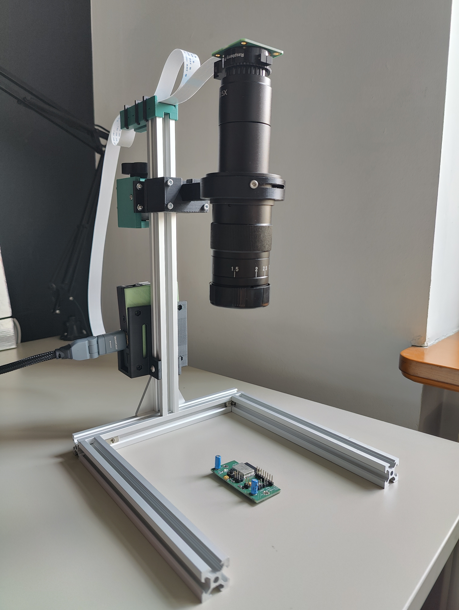
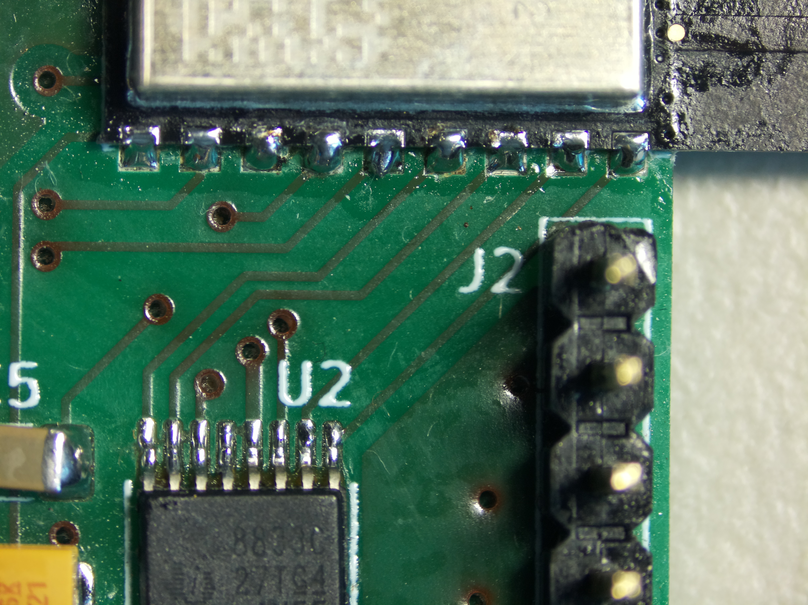
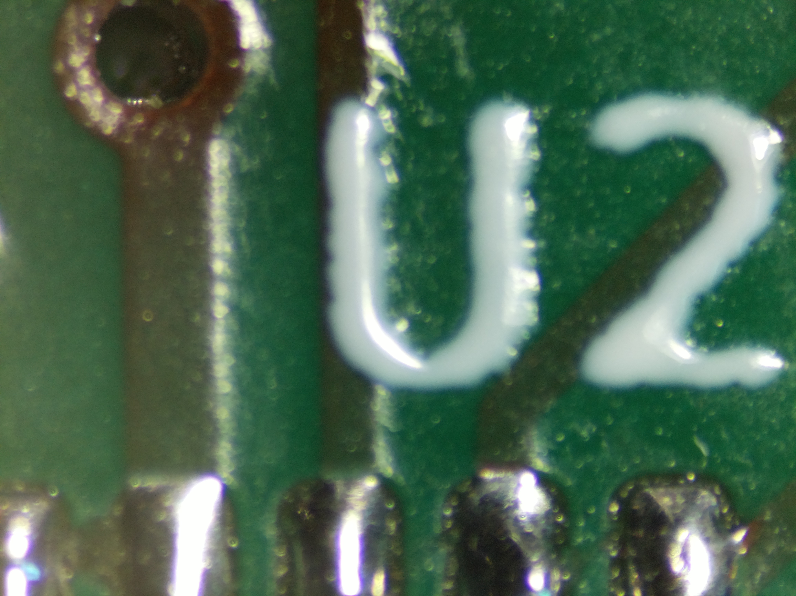
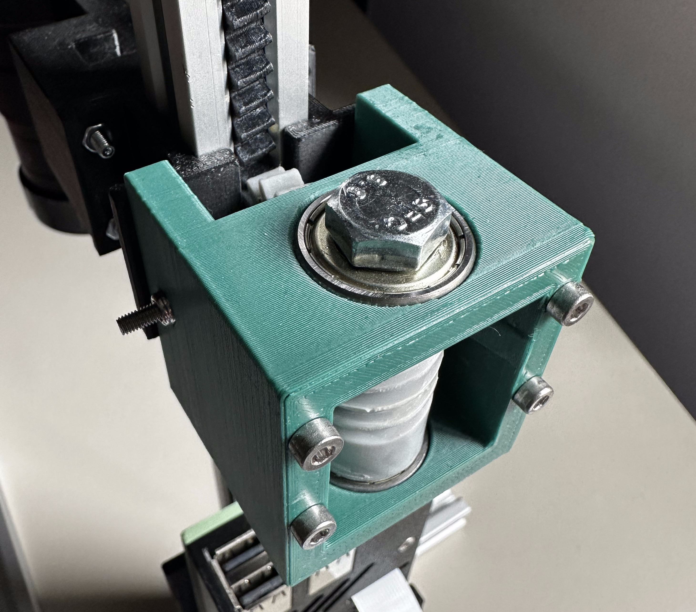

# Rapiscope
The rack and pinion-adjustable, rapidly 3D-printable, Raspberry Pi-based digital microscope for soldering (and more!).

## What is it?
This project uses:
* Raspberry Pi 3 or 4
* Raspberry Pi HQ camera with a C-mount microscope lens
* v-slot aluminium profiles
* a bunch of commodity fasteners and bearings I had laying around

to create a digital microscope with a regulated working distance (and therefore, zoom).

It utilizes a 3D printed version of a mechanism that's been commonplace in analog microscopes
for ages - the [rack and pinion](https://www.microscope-antiques.com/randp.html), driven by a
worm gear to ensure self-locking (knob removed for demonstration purposes):

## Motivations

While this entire project can be bought as a unit (be it with a built-in
screen, or only a camera, sometimes with a helping hand) from various manufacturers,
DYI'ing allowed me to build this from reusable and commodity components.

I was also able to introduce a motion system that doesn't rely on me holding the lens as I move it.

Thanks to the use of aluminium profiles for the structure, I will be able to easily
extend this with your usual soldering station suspects - for example, a fume extractor.

Additionally, with the Raspberry Pi on board, I can look both at the thing I'm soldering,
and its schematics, on one screen.

## Building
If you're interested in building the Rapiscope, check out:

* [bill of materials](./docs/bill-of-materials.md)
* [build guide](./docs/build-guide.md)

## Acknowledgements and prior work
* [/u/SilentMobius](https://www.reddit.com/user/SilentMobius/)' [Raspberry Pi Microscope](https://www.reddit.com/r/raspberry_pi/comments/oukppg/raspberry_pi_hq_camera_microscope_v2/)
* [OpenFlexure](https://openflexure.org/projects/microscope/) - this is where to go if you were looking for something more classic microscope-y rather than work-station-microscope-y
