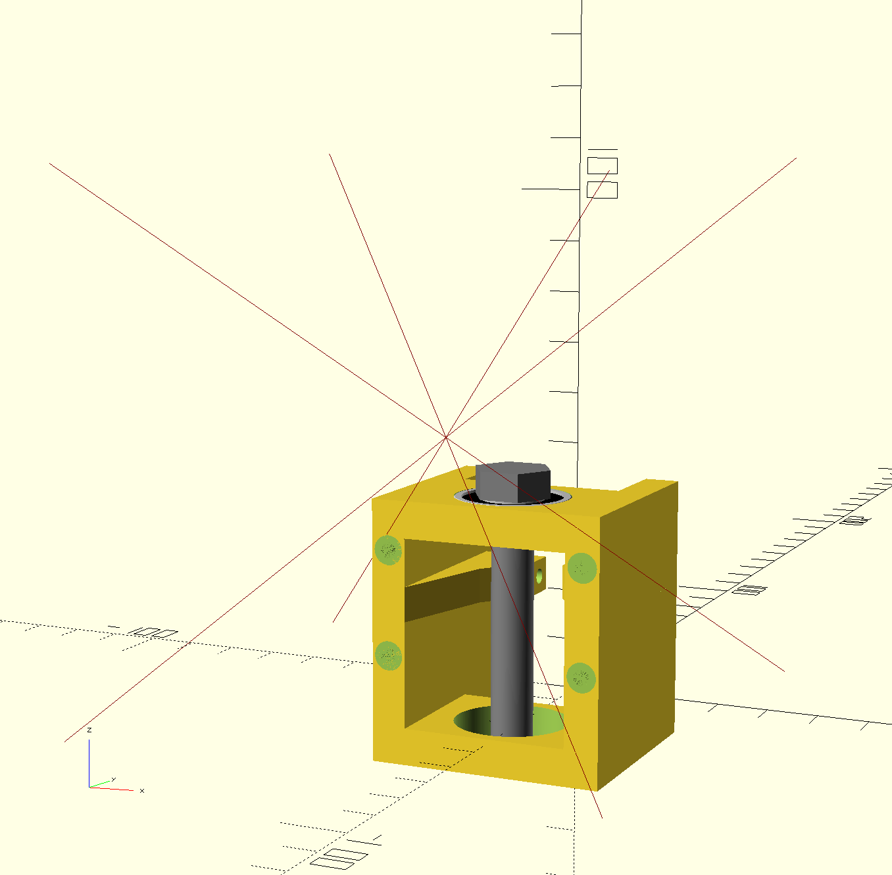

# Build guide

## Protips
* The ["screw pulling technique"](https://help.prusa3d.com/guide/1-introduction_176529#176814) will help you get your nuts into tricky places.
* Use a flat surface to make sure the bearings fit properly.

## Gearbox
* 1 x housing
* 2 x 608zz bearing
* 1 x M8x50 hex head
* 1 x worm
* 1 x M8 nyloc nut
* 1 x knob
* 1 x pinion
* 1 x 623zz bearing
* 1 x M3x50
* 1 x M3 nut
* plastic-safe grease (I used white lithium grease from WD-40, but silicone grease should do as well)

### Worm gear
Start by inserting the bearing into the top bearing holder.


Next, pass the M8x50 hex head bolt through the top bearing, head facing up. 




Place the worm gear on the bolt, nut side down.


Thread the M8 nyloc nut, circular side facing down, onto the bolt. Move the worm gear to capture the nut, and then,
holding the worm gear with your hand so that it doesn't rotate, use either a spanner wrench, or the knob, to fasten
the bolt until the worm gear is in place: just below the bearing, but not in contact with it and able to rotate freely
(this step is finicky and requires some strength and dexterity, next version will address this).


Insert the bottom bearing into the bottom bearing holder, onto the bolt.


### Pinion gear
Insert the 623zz bearing into the pinion gear. 

Insert the pinion gear into its place, and secure with the M3x50 bolt and nut (orientation doesn't matter).
Make sure to not overtighten - ensure the gear can rotate freely when the worm gear is rotated.


That's it, you're done!


**Lubricate your gearbox. I cannot stress this enough. Depending on the material, without lubrication, the lifetime of your gearbox will get impractically low.** Keep in mind we're holding onto a fair amount of weight and money here.

## Frame
* 3 x v-slot 2020, 20 cm
* 2 x 90 degree joining plate
* 1 x v-slot 2020, 30 cm or 40 cm
* 1 x T joining plate
* 15 x M5x10
* 15 x M5 2020 t-nut

First, put together the base of the frame. Join the three 20 cm v-slot extrusions using the two 90 degree joining plates to form a "U".
The envelope of the "U" will be our microscope's working field.

Next, mount the Z axis 2020 v-slot to the extrusion at the bottom of the "U", pointing up, using the T joining plate.

## Raspberry Pi mount
* rpi-mount
* 2 x M4x8
* 2 x M4 t-nut

Mount the rpi-mount, facing away from the working field, onto the Z axis extrusion just above the T joining plate, using the M4x8 bolts and t-nuts.

## Motion system
* [Gearbox](#gearbox)
* 1 x knob
* 1 x rack
* 1 x slider
* 2 x M4x8
* 2 x M4 t-nut
* 4 x M3 nut
* 4 x M3x50

Start by mounting the rack, facing away from the working field, onto the Z axis extrusion, with its top some 5 mm below the end of the extrusion.
Secure it with the two M4x8 bolts and t-nuts.

Place the slider on the Z axis extrusion, noting the clearance for the rack. Slide it down to the middle of the rack, so that you're able to mount the gearbox.

(Protip: you can temporarily secure the slider in place by placing a bolt and a t-nut below it.)

Place the M3 nuts in the nutcatches on the side facing away from the workfield.
Secure the gearbox, hex bolt head up, onto the slider with the four M3x50 bolts.

If you didn't yet, now is the time to place the knob on the hex bolt head.

## Microscope mount
* 1 x microscope-mount
* 4 x M3 nut
* 4 x M3x40

Place the M3 nuts in the nutcatches on the side facing the workfield.
Place the microscope-mount on the slider, the clearance for the holder facing up. Secure with the four M3x40 bolts.

## Top cable guide
* 1 x top-cable-guide

Place the top cable guide on top of the Z axis extrusion, the longer part facing away from the working field.
(Protip: if your camera ribbon cable is too long for your Z axis length, fold it underneath the cable clip.)

## Optics
* 1 x Raspberry Pi HQ camera [with the C-CS adapter installed](https://datasheets.raspberrypi.com/hq-camera/c-mount-lens-guide.pdf)
* 1 x C-mount microscope lens
* 1 x Raspberry Pi camera cable, 80 cm
* 1 x Raspberry Pi 3 or 4
* 1 x microscope-holder
* 3 x top-cable-clip (optional, you can also use zip ties)
* 1 x M3x12 

[Disconnect the existing camera cable from the camera and connect the longer one. Connect it to the Raspberry Pi.](https://www.raspberrypi.com/documentation/accessories/camera.html#connecting-the-camera)
Mount the Raspberry Pi HQ camera on the C-mount microscope lens.
Place the lens in the holder. Secure with the M3x12 bolt.
Route the ribbon cable through the top cable guide and secure with the clips or zip ties.

## First run
Start up the Raspberry Pi. Once it boots up, run the command:

```sh
libcamera-vid -t 0 --rotation 180 -f
```

It should open a window previewing what the camera is seeing. Use the height adjustment and zoom adjustment to focus the image.

There it is, that's Rapiscope!

---
If you run into any issues while making Rapiscope, please don't hesitate to e-mail me!
